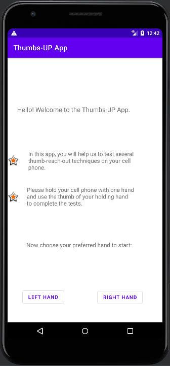
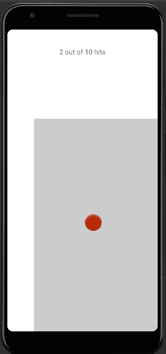
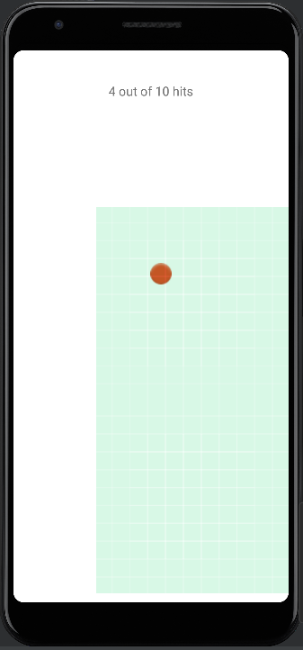
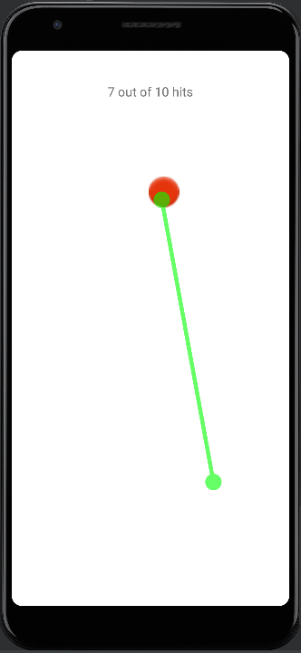
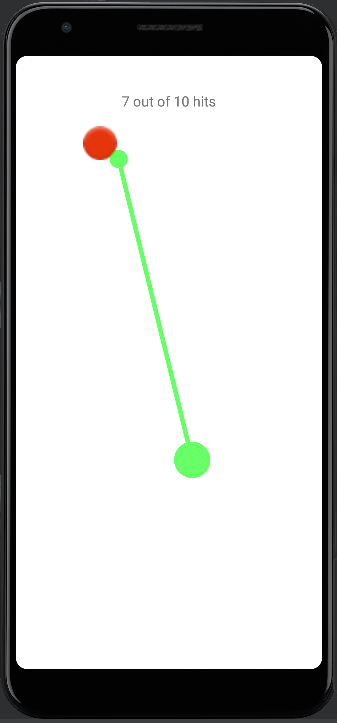
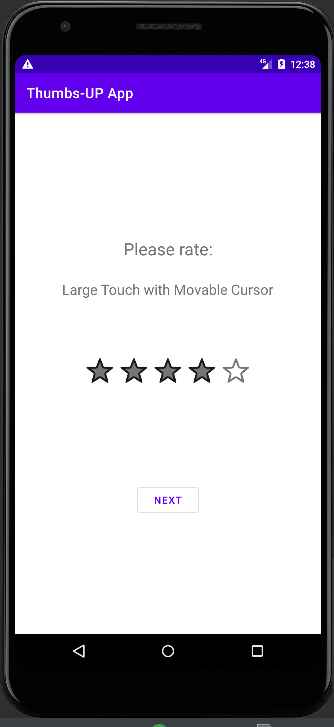

# Project - Interaction Techniques for Unreachable Objects on the Touchscreen

The App in this repository is built for a HCI research project in the UBC COSC 541 course. It is to develop demostrations of eight interaction techniques with one-hand handling on a large cell phone torchscreen. It also has functionality to gather user testing data and evaluation for user studying purpose.

## Development Environment and Deployment

This app is developed in the Android Studio and it is suppose to run on a smartphone with an Android 5.0+ operation system. Since this research is focus on unreachable Objects on a large touchscreen, the best practical running platform would be a cellphone with 6.0+ inches screen and 1080 x 2160 resolution.

To setup and test this App, first we will need to download (or clone) all files in this repository and then use the "import project" option in the Android Studio File menu to load and setup the project. To test the app, we will need to create a virtual device, i.g. Pixel 3a XL, using the "Device Manager" tool in the Android Studio, or connect a physical smart phone to our workstation with a USB cable (in this way you will need to open debug mode option in your cell phone security settings). When this device (either the virtual or physical one) is turned on and connected to the device manager in Android Studio, the app is ready to run on it by choosing the "run app" option in the menu.

Another way to deploy this app to a smart cell phone is to build a APK file (installation package) by Android Studio, and then send the APK file to an Android cell phone and install the APK on it. After that, this App can run on the cell phone like normal apps. A pre-built APK file "thumbs-up-app.apk" is placed on this repository.

## App Design
The app is design for general users to try out using two triggering methods combine with four selection (so eight techniques in total) to reach a target out of their thumb zone. The user will be ask to manipulate this app and finish all the test by just one hand (holding the cell phone and selecting the target with technique aids). At the beginning the app will introduce and let user choose their using hand. As follow screen shows. 

After users select a prefer hand, the app will guide them through all eight techniques test one by one. For each test, it start with a introduction, and then it set a total times for a test. (10 times by default, and it and be changed by the variable "totalHits" in each TestActivity Class). For each test, it general a red target button outside a user's thumb zone, and users are asked to hit that target by the particular technique aid. Through this process, the HCI technique is demonstrated to the user. Also, the average time per hit and hit accuracy of the user will be monitored by the app and collected for further techniques analysis. The accuracy is calculated by the number of effective operations over the number of total operations in one test. Following are some images show the technique testing activities.

<figure><figcaption align = "center">Sliding Screen</figcaption></figure>    <figure><figcaption align = "center">Screen Reduction</figcaption></figure>    <figure><figcaption align = "center">Extendale Cursor</figcaption></figure>    <figure><figcaption align = "center">Movable Cursor</figcaption></figure>

Besides the completion time of each trial and the accuracy of user operations, the app also asks users to rate their preferrence when they finish each techniques test. Those ratings will also be part of evaluation data for further purpose of user study. The following is an example of user preferrence rating screen.

After all testing and evaluation data are collected, the app automatically generate a report for it. At the end of last activity page, users are asked to send the testing report to the researcher. There are two way to collect that report. First the app will launch the default email app of the user's Andriod smart phone and the content of the email will be the plain text of the report. The app also send the report as logs to the concole of Andriod Studio, so the other way to collect those testing report is to connect the cell phone to Andriod Studio device manager with a cable and copy the testing report to a TXT file and save it as CSV. The following table show an example and the format of this testing report.

| Technique No.  | Avg Completion Time (ms) | Accuracy of Operation | User Rating (0~5 stars) |
| ------------- | ------------- | ------------- | ------------- |
| 1  | 4119  | 0.9090909090909091  | 3.0  |
| 2  | 4771  | 0.3448275862068966  | 2.0  |
| 3  | 3407  | 0.5882352941176471  | 4.0  |
| 4  | 1945  | 0.5555555555555556  | 4.0  |
| 5  | 11506  | 0.7692307692307693  | 2.0  |
| 6  | 12499  | 0.08771929824561403  | 2.0  |
| 7  | 14945  | 0.12345679012345678  | 4.0  |
| 8  | 7292  | 0.12048192771084337  | 3.0  |

## Source Code Files and Documentations

All the Source Code files and user study related documents are presented in the repository. Following are the details of their oganization:

./app/ --All project files for this app, included project setting for Andriod Studio

./aap/src/main/ --All the Source code we created, included resource and activity setup file

./aap/src/main/java/com/example/thumbs_upapp/ --all the back-end code of implemented in Java, each Class corresonding to an app activities  

./aap/src/main/res/layout/ --all the frond-end code, each XML file corresonding to an app activities layout 

./ResearchProjectLogs/ --all the testing report collected for user study, including analysis code in R, and analysis results

## References and Acknowledgements
The interaction thecniques idea we come up with is extracted from the following research papers.

[1] Chang, Y. a. (2015). Understanding Users' Touch Behavior on Large Mobile Touch-Screens and Assisted Targeting
 by Tilting Gesture. Proceedings of the 33rd Annual ACM Conference on Human Factors in Computing Systems, 
1499–1508. doi:10.1145/2702123.2702425

[2] Kim, S. a. (2012). Interaction Techniques for Unreachable Objects on the Touchscreen. Proceedings of the 24th 
Australian Computer-Human Interaction Conference, 295-298. doi:10.1145/2414536.2414585

The development of our app refer to the tutorial and sample codes of the official Android developer website.

 - [Android API reference](https://developer.android.com/reference)

## Authors
The code in this repository is developed by
- Zenab Kagdiwala (zenabk@student.ubc.ca)
- Joe Chen (joe.chen@ubc.ca)

